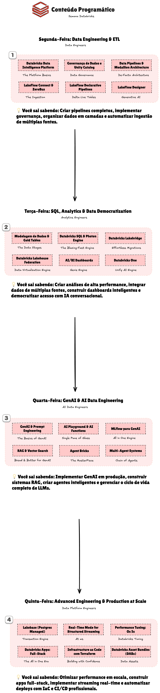

# Semana Databricks 2.0

Hands-on training covering Databricks Data Intelligence Platform, from data engineering fundamentals to advanced GenAI implementations.

## Weekly Agenda

### 1) Data Engineering & ETL
**Topics**: Platform fundamentals, data governance, and pipeline orchestration
**Learn**: Build complete data pipelines, implement governance with Unity Catalog, orchestrate multi-source ingestion with LakeFlow

- Databricks Data Intelligence Platform
- UberEats Use Case & Data Sources
- Data Governance with Unity Catalog
- Data Pipelines & Medallion Architecture
- LakeFlow Connect & ZeroBus
- LakeFlow Declarative Pipelines
- LakeFlow Jobs & Designer

### 2) SQL, Analytics & Data Democratization
**Topics**: High-performance analytics, data modeling, and intelligent dashboards
**Learn**: Create advanced analytics, integrate multiple data sources, build AI-powered dashboards for self-service

- Data Modeling & Gold Tables
- Databricks SQL & Photon Engine
- Databricks Lakebridge & Lakehouse Federation
- AI/BI Dashboards, Genie & Alerts
- Databricks One
- Hex: Agentic Analytics Platform

### 3) GenAI & AI Data Engineering
**Topics**: GenAI implementation, RAG systems, and intelligent agents
**Learn**: Implement GenAI in production, create RAG systems, build multi-agent systems with MCP

- Prompt Engineering & AI Playground
- AI Functions & MLflow for GenAI
- Serving Endpoints & AI Gateway
- RAG & Vector Search
- AI Agents, Agent Bricks & Multi-Agent Systems
- MCP (Model Context Protocol) & LLMOps

### 4) Advanced Engineering & Production at Scale
**Topics**: Performance optimization, real-time streaming, and infrastructure automation
**Learn**: Optimize at scale, implement real-time streaming, automate infrastructure with Terraform and DABs

- Lakebase (Postgres Managed)
- Real-Time Mode for Structured Streaming
- Performance Tuning: Os 5s
- Advanced Cluster Tuning
- Databricks Apps: Full-Stack
- Infrastructure as Code with Terraform
- Databricks Asset Bundles (DABs)

## Repository Structure

- [lakeflow/](lakeflow/) - Declarative pipelines (Bronze � Silver � Gold)
- [docs/](docs/) - Training documentation and assets
